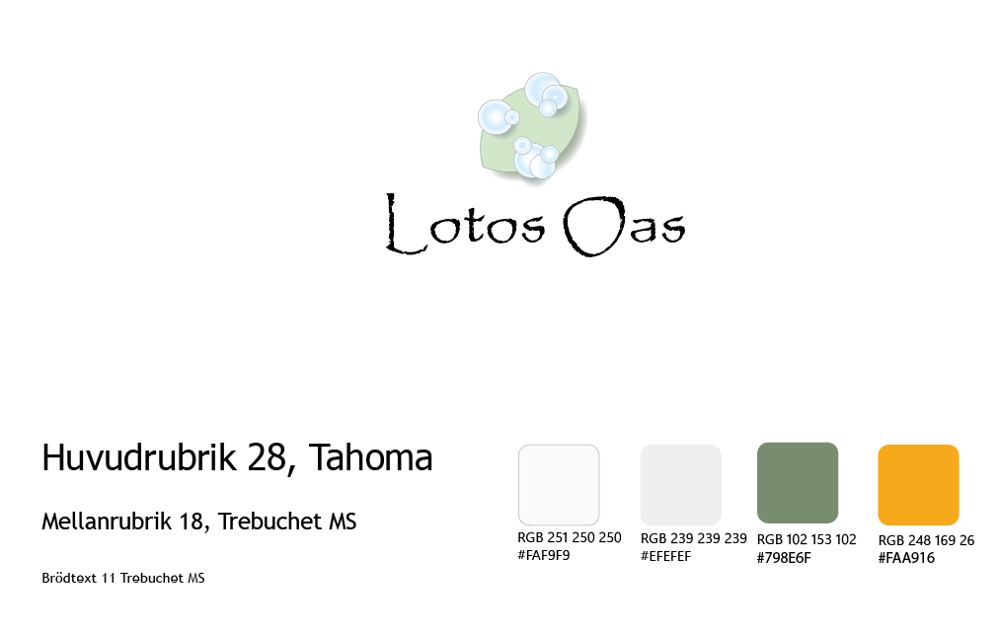

## Beskrivning

Detta är en inlämningsuppgift med grafisk design. Man ska ta fram en egen design, skapa en logotyp, symbol, färg och typsnitt.

- Grafisk design - Illustrator
- Wireframes, Mockup - Figma
- Applikation - React och Tailwind

## Grafisk design

## Wireframe

## Mockup

